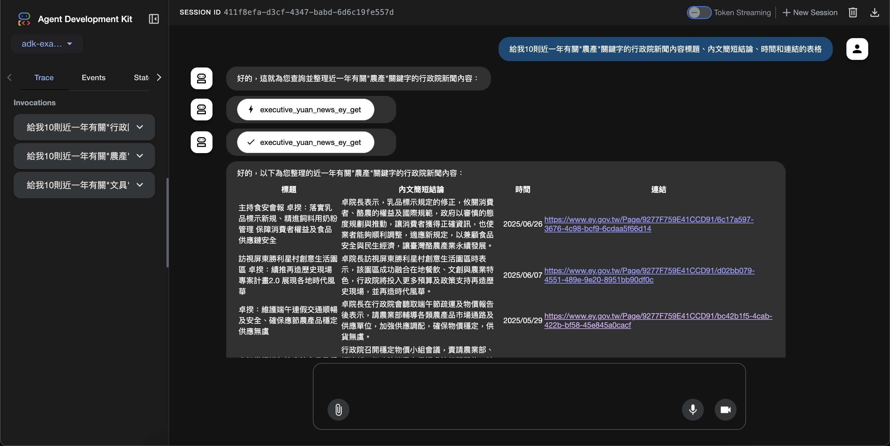

# google-adk-openapi-taiwan-ey-gov - OpenAPI ADK Taiwan EY Gov

This project demonstrates the use of Google's OpenAPI ADK (Agent Development Kit) for Taiwan's Executive Yuan (EY) government services. It provides an example agent that can interact with various government APIs.

## Getting Started

Follow these instructions to set up and run the project on your local machine.

### Prerequisites

- Python 3.8+
- pip (Python package installer)
- virtualenv (recommended for dependency management)

### Installation

1.  **Clone the repository:**

    ```bash
    git clone https://github.com/LiuYuWei/google-adk-openapi-taiwan-ey-gov.git
    cd google-adk-openapi-taiwan-ey-gov
    ```

2.  **Create and activate a virtual environment:**

    ```bash
    python3 -m venv venv
    source venv/bin/activate
    ```

3.  **Install dependencies:**

    ```bash
    make install
    ```

### Configuration

Create a `.env` file in the `openapi-taiwan-ey-gov/` directory and add your environment variables. For example:

```
GOOGLE_API_KEY="YOUR_GOOGLE_API_KEY"
```

### Running the Application

To start the ADK agent, use the `make run` command:

```bash
make run
```

This will start the ADK web interface, and you can interact with the agent through it.

### Project Structure

- `openapi-taiwan-ey-gov/`: Contains the core agent logic and configuration.
  - `agent.py`: The main agent application.
  - `swagger.json`: OpenAPI specification for the government services.
  - `.env`: Environment variables for API keys and other configurations.
- `venv/`: Python virtual environment.
- `Makefile`: Automation scripts for installation and running the application.
- `requirements.txt`: Python dependencies.

## Usage

Once the application is running, you can interact with the agent via its API endpoints. You can interact with the agent through the ADK web interface.



## License

This project is licensed under the MIT License - see the LICENSE file for details.
